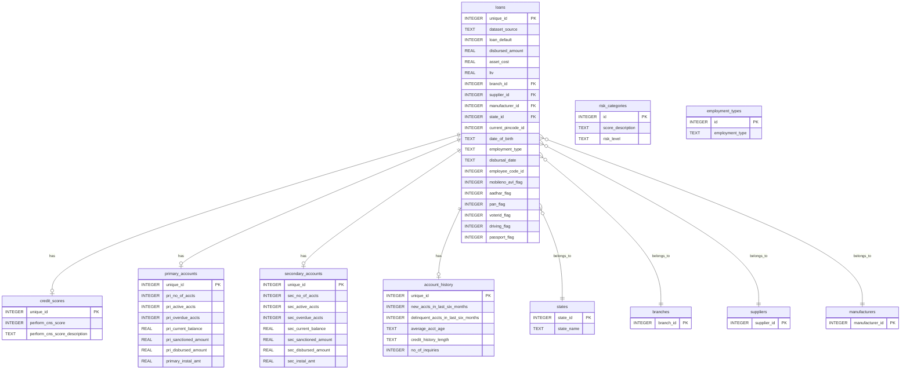

# Loan Database Schema Documentation

## Overview

ฐานข้อมูล `loan_database.sqlite` เก็บข้อมูลสินเชื่อยานพาหนะ ประกอบด้วย **345,546** รายการ โดยแบ่งเป็น:
- **Train set**: 233,154 records (มี loan_default)
- **Test set**: 112,392 records (ไม่มี loan_default)

**ขนาดไฟล์**: ~85 MB

---

## Entity Relationship Diagram



---

## Tables

### 1. `loans` (Main Table)
ตารางหลักเก็บข้อมูลสินเชื่อ

| Column | Type | PK | FK | Description |
|--------|------|:--:|:--:|-------------|
| `unique_id` | INTEGER | ✅ | | รหัสลูกค้า |
| `dataset_source` | TEXT | | | แหล่งข้อมูล ('train' หรือ 'test') |
| `loan_default` | INTEGER | | | สถานะ default (1=default, 0=ไม่ default, NULL=test set) |
| `disbursed_amount` | REAL | | | จำนวนเงินที่ปล่อยกู้ |
| `asset_cost` | REAL | | | มูลค่าทรัพย์สิน |
| `ltv` | REAL | | | Loan-to-Value ratio |
| `branch_id` | INTEGER | | ✅ | รหัสสาขา → `branches.branch_id` |
| `supplier_id` | INTEGER | | ✅ | รหัสผู้จำหน่าย → `suppliers.supplier_id` |
| `manufacturer_id` | INTEGER | | ✅ | รหัสผู้ผลิต → `manufacturers.manufacturer_id` |
| `current_pincode_id` | INTEGER | | | รหัสไปรษณีย์ปัจจุบัน |
| `date_of_birth` | TEXT | | | วันเกิด |
| `employment_type` | TEXT | | | ประเภทการจ้างงาน |
| `disbursal_date` | TEXT | | | วันที่ปล่อยกู้ |
| `state_id` | INTEGER | | ✅ | รหัสรัฐ → `states.state_id` |
| `employee_code_id` | INTEGER | | | รหัสพนักงานที่บันทึก |
| `mobileno_avl_flag` | INTEGER | | | มีเบอร์มือถือ (0/1) |
| `aadhar_flag` | INTEGER | | | มี Aadhar card (0/1) |
| `pan_flag` | INTEGER | | | มี PAN card (0/1) |
| `voterid_flag` | INTEGER | | | มี Voter ID (0/1) |
| `driving_flag` | INTEGER | | | มีใบขับขี่ (0/1) |
| `passport_flag` | INTEGER | | | มี Passport (0/1) |

---

### 2. `credit_scores`
ข้อมูลคะแนนเครดิตบูโร

| Column | Type | PK | FK | Description |
|--------|------|:--:|:--:|-------------|
| `unique_id` | INTEGER | ✅ | → `loans.unique_id` | รหัสลูกค้า |
| `perform_cns_score` | INTEGER | | | คะแนน Bureau Score |
| `perform_cns_score_description` | TEXT | | | คำอธิบายคะแนน (ใช้ JOIN กับ `risk_categories.score_description` ใน View) |

---

### 3. `primary_accounts`
บัญชีหลัก (สินเชื่อที่ลูกค้าเป็นผู้กู้)

| Column | Type | PK | FK | Description |
|--------|------|:--:|:--:|-------------|
| `unique_id` | INTEGER | ✅ | → `loans.unique_id` | รหัสลูกค้า |
| `pri_no_of_accts` | INTEGER | | | จำนวนบัญชีทั้งหมด |
| `pri_active_accts` | INTEGER | | | จำนวนบัญชีที่ active |
| `pri_overdue_accts` | INTEGER | | | จำนวนบัญชีที่ค้างชำระ |
| `pri_current_balance` | REAL | | | ยอดคงเหลือปัจจุบัน |
| `pri_sanctioned_amount` | REAL | | | วงเงินอนุมัติทั้งหมด |
| `pri_disbursed_amount` | REAL | | | ยอดเงินที่ปล่อยกู้ทั้งหมด |
| `primary_instal_amt` | REAL | | | ยอดผ่อนต่อเดือน |

---

### 4. `secondary_accounts`
บัญชีรอง (สินเชื่อที่ลูกค้าเป็นผู้ค้ำประกัน)

| Column | Type | PK | FK | Description |
|--------|------|:--:|:--:|-------------|
| `unique_id` | INTEGER | ✅ | → `loans.unique_id` | รหัสลูกค้า |
| `sec_no_of_accts` | INTEGER | | | จำนวนบัญชีทั้งหมด |
| `sec_active_accts` | INTEGER | | | จำนวนบัญชีที่ active |
| `sec_overdue_accts` | INTEGER | | | จำนวนบัญชีที่ค้างชำระ |
| `sec_current_balance` | REAL | | | ยอดคงเหลือปัจจุบัน |
| `sec_sanctioned_amount` | REAL | | | วงเงินอนุมัติทั้งหมด |
| `sec_disbursed_amount` | REAL | | | ยอดเงินที่ปล่อยกู้ทั้งหมด |
| `sec_instal_amt` | REAL | | | ยอดผ่อนต่อเดือน |

---

### 5. `account_history`
ประวัติบัญชี

| Column | Type | PK | FK | Description |
|--------|------|:--:|:--:|-------------|
| `unique_id` | INTEGER | ✅ | → `loans.unique_id` | รหัสลูกค้า |
| `new_accts_in_last_six_months` | INTEGER | | | บัญชีใหม่ใน 6 เดือน |
| `delinquent_accts_in_last_six_months` | INTEGER | | | บัญชีที่ผิดนัดใน 6 เดือน |
| `average_acct_age` | TEXT | | | อายุบัญชีเฉลี่ย |
| `credit_history_length` | TEXT | | | ระยะเวลาประวัติเครดิต |
| `no_of_inquiries` | INTEGER | | | จำนวนครั้งที่สอบถามเครดิต |

---

### 6. Lookup Tables

#### `states`
| Column | Type | PK | Description |
|--------|------|:--:|-------------|
| `state_id` | INTEGER | ✅ | รหัสรัฐ |
| `state_name` | TEXT | | ชื่อรัฐ |

#### `branches`
| Column | Type | PK | Description |
|--------|------|:--:|-------------|
| `branch_id` | INTEGER | ✅ | รหัสสาขา |

#### `suppliers`
| Column | Type | PK | Description |
|--------|------|:--:|-------------|
| `supplier_id` | INTEGER | ✅ | รหัสผู้จำหน่าย/Dealer |

#### `manufacturers`
| Column | Type | PK | Description |
|--------|------|:--:|-------------|
| `manufacturer_id` | INTEGER | ✅ | รหัสผู้ผลิต (Hero, Honda, TVS ฯลฯ) |

#### `risk_categories`
| Column | Type | PK | Description |
|--------|------|:--:|-------------|
| `id` | INTEGER | ✅ | Auto-increment ID |
| `score_description` | TEXT | | คำอธิบายคะแนน (unique) |
| `risk_level` | TEXT | | ระดับความเสี่ยง |

#### `employment_types`
| Column | Type | PK | Description |
|--------|------|:--:|-------------|
| `id` | INTEGER | ✅ | Auto-increment ID |
| `employment_type` | TEXT | | ประเภทการจ้างงาน (unique) |

#### `data_dictionary`
| Column | Type | PK | Description |
|--------|------|:--:|-------------|
| `id` | INTEGER | ✅ | Auto-increment ID |
| `variable_name` | TEXT | | ชื่อตัวแปร |
| `description` | TEXT | | คำอธิบาย |
| `additional_detail` | TEXT | | รายละเอียดเพิ่มเติม |

---

## Views

### 1. `v_loan_complete`
รวมข้อมูลทั้งหมดจากทุกตาราง (43 columns)

```sql
SELECT * FROM v_loan_complete LIMIT 10;
```

### 2. `v_loans_by_state`
สรุปสินเชื่อตามรัฐ

```sql
SELECT * FROM v_loans_by_state;
-- Columns: state_id, total_loans, default_count, avg_disbursed_amount, avg_ltv
```

### 3. `v_loans_by_risk`
สรุปตามระดับความเสี่ยง

```sql
SELECT * FROM v_loans_by_risk;
-- Columns: risk_level, perform_cns_score_description, total_loans, default_count, avg_disbursed_amount
```

### 4. `v_loans_by_employment`
สรุปตามประเภทการจ้างงาน

```sql
SELECT * FROM v_loans_by_employment;
-- Columns: employment_type, total_loans, default_count, avg_disbursed_amount, avg_ltv
```

---

## Indexes

| Index Name | Table | Column(s) | Purpose |
|------------|-------|-----------|---------|
| `idx_loans_branch` | loans | branch_id | เร่งการค้นหาตามสาขา |
| `idx_loans_state` | loans | state_id | เร่งการค้นหาตามรัฐ |
| `idx_loans_manufacturer` | loans | manufacturer_id | เร่งการค้นหาตามผู้ผลิต |
| `idx_loans_employment` | loans | employment_type | เร่งการค้นหาตามประเภทงาน |
| `idx_loans_default` | loans | loan_default | เร่งการค้นหาตาม default status |
| `idx_credit_scores_score` | credit_scores | perform_cns_score | เร่งการค้นหาตามคะแนนเครดิต |

---

## Sample Queries

### ดูข้อมูลสินเชื่อทั้งหมด
```sql
SELECT * FROM v_loan_complete WHERE dataset_source = 'train' LIMIT 10;
```

### คำนวณ Default Rate ตามรัฐ
```sql
SELECT state_id, 
       COUNT(*) as total,
       SUM(CASE WHEN loan_default = 1 THEN 1 ELSE 0 END) as defaults,
       ROUND(100.0 * SUM(CASE WHEN loan_default = 1 THEN 1 ELSE 0 END) / COUNT(*), 2) as default_rate
FROM loans 
WHERE dataset_source = 'train'
GROUP BY state_id
ORDER BY default_rate DESC;
```

### หาลูกค้า High Risk ที่มียอดสินเชื่อสูง
```sql
SELECT l.unique_id, l.disbursed_amount, cs.perform_cns_score_description
FROM loans l
JOIN credit_scores cs ON l.unique_id = cs.unique_id
WHERE cs.perform_cns_score_description LIKE '%High Risk%'
  AND l.disbursed_amount > 50000
ORDER BY l.disbursed_amount DESC
LIMIT 10;
```

### ดู Data Dictionary
```sql
SELECT variable_name, description FROM data_dictionary;
```
